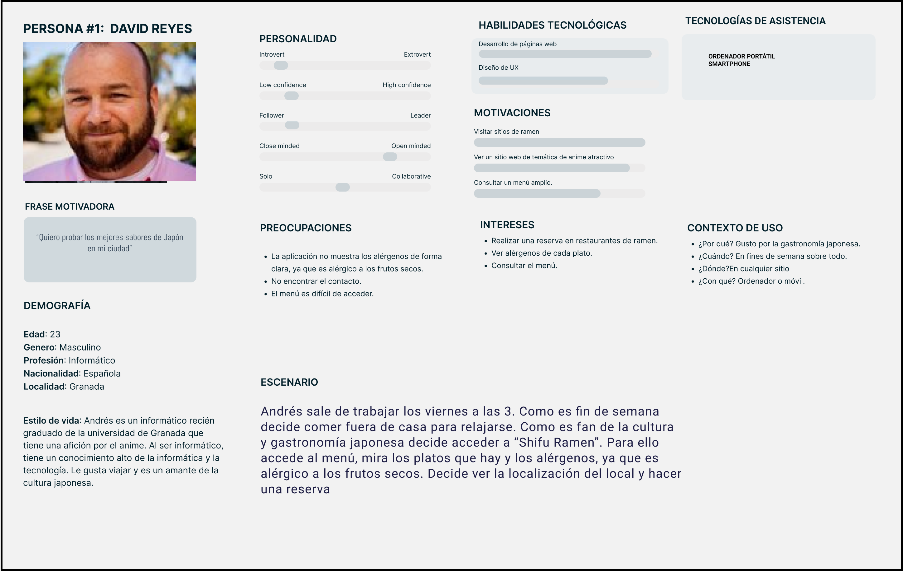
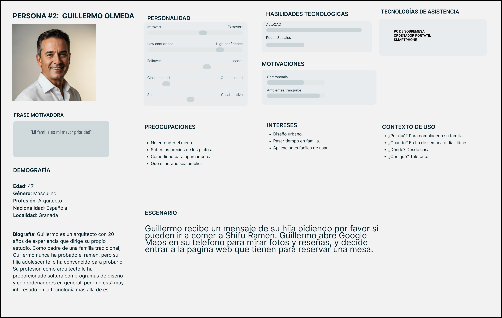
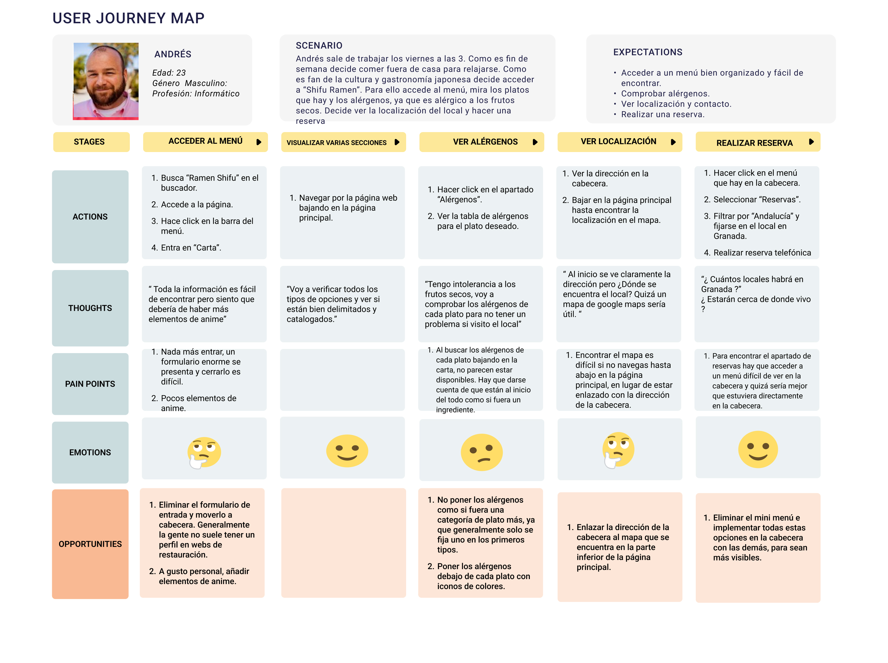
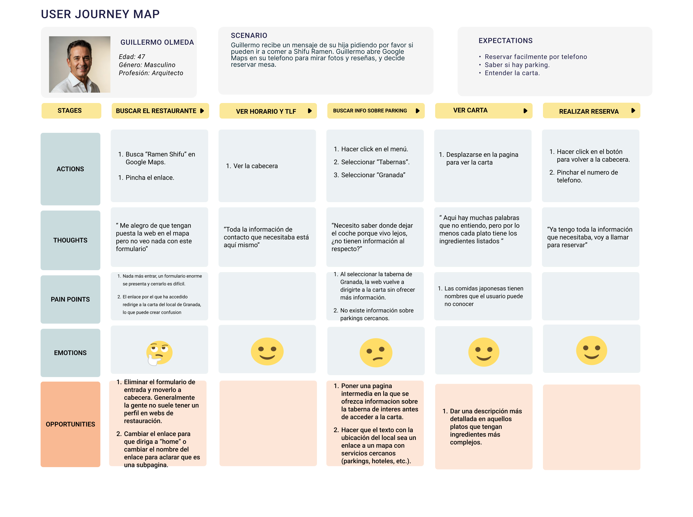

## DIU - Practica1, entregables

- Desk research: Análisis Competencia 
- 2 Personas 
- 2 User Journey Map  ( 1 por persona)
- Revisión de Usabilidad 

>>>> Este fichero se debe editar para que cada evidencia quede enlazada con el recurso subido a la carpeta de la practica. Se pide más detalle técnico en las descripciones de lo que sería el README principal del repositorio y que corresponde a la descripcion del Case Study.
>>>> Incluya aquí simpre una valoración final del equipo sobre la propia realización de la práctica

### 1.a User Research Plan 

## 1 Descripción 

El establecimiento **Shifu Ramen** es un restaurante japonés especializado sobre todo en ramen y que combina la comida con la cultura del manga y el anime en un espacio para amantes de este género, cuya popularidad ha escalado exponencialmente en la última década. Como se ha descrito previamente, el plato insignia es el ramen, que es una especie de sopa con fideos que contiene otros elementos como huevo, vegetales o carne.

#### 1. Antecedentes y Objetivos (The "Why")

- **Contexto:** 

Con este estudio, se pretende realizar un análisis del comportamiento del usuario en este tipo de páginas web de restauración ( sobre todo japonesa ) con el fin de hacer un diseño y desarrollo de la aplicación del restaurante.

- **Objetivos de investigación:** 

Se pretende con este análisis que la aplicación cuente con una serie de características que optimicen la experiencia de usuario. Algunos de los más importantes son:

- Facilidad para el usuario de acceder al menú en un tiempo razonable.
- Que este menú sea informativo de cada plato y sea fácil comprobar alérgenos.
- Tener una apariencia atractiva basada en el anime japonés que sea interesante pero que no eclipse el propósito del restaurante, que es el de ofrecer comida.
- Disponer de un formulario sencillo y accesible para la gestión de reservas.
- Comprender los gustos del usuario para adaptar el menú.
- Analizar qué comportamiento tienen los nuevos usuarios para atraer más usuarios.

- **Experiencia del equipo / justificación**

    - **Jose María Martín**: "Como desarrollador, he trabajado en otros proyectos de restauración y frecuento páginas de anime, por lo que este proyecto me es muy interesante".
    - **David López**: "Como Stakeholder, he estado en otros proyectos de restauración y quiero explotar el mercado del anime japonés."   
    - **María Alonso**: "Como empleada de otro sitio de ramen, observo que la gente quiere un espacio gastronómico de temática de anime para los fans de este género, pero que no sea demasiado cargante para posibles nuevos consumidores."

#### 2. Metodología (The "How")

Se pretenden seleccionar técnicas no muy complejas en este estudio, pues en una página de restauración se espera que el usuario haga un uso rápido como encontrar el menú o gestionar una reserva:

- **Entrevistas:** Estas entrevistas por lo general estarán dirigidas a fans del anime y/o cultura japonesa, preguntando por experiencias en sitios similares y cómo les gustaría que fuera la temática de la aplicación. Además, también se entrevistarían a otro tipo de grupo como personas más mayores y normalmente más alejadas de esta cultura para analizar qué podría atraerles a este tipo de restaurantes. **Método cualitativo y actitudinal**.

- **A/B Testing + Eye tracking**: De esta forma, realizaríamos un tipo de interfaz más rica en elementos de anime y otra un poco más austera lo que, sumado al **eye tracking**, nos permite ver si quizá un equilibrio entre clientes afines al anime y no afine es lo más rentable, o por contrario enfocarnos en un diseño mucho más cargado dedicado al público objetivo que son los fans del anime en detrimento de la experiencia de otros usuarios menos interesados. **Método cuantitativo y de comportamiento**.

- **A/B Testing + Test de usabilidad**: Volvemos a comparar diseño recargado versus diseño más simple, dando instrucciones y tareas a ciertos participantes para ver cómo reaccionan y que tan rápido acceden a ciertos sitios. **Método cualitativo y de comportamiento (test de usabilidad) y cuantitativo y de comportamiento ( A/B Testing )**.

ref: https://www.nngroup.com/articles/which-ux-research-methods/

#### 3. Perfil de los Participantes (The "Who")

Como se ha comentado previamente, distinguimos dos grupos de posibles usuarios, afines a la cultura del anime y personas ajenas a esta cultura. Se seleccionan **25 participantes** para entrevistar, distribuidos en:

- **20 participantes interesados en el anime**, de edad joven ( 16-35 años ). Se asume cierto nivel de uso tecnológico, ya que generalmente este tipo de contenidos se consumen por internet. Además, de estos 20 participantes, se seleccionan 5 de origen japonés y 15 de origen no japonés, por cuestiones de mejor entendimiento de esta cultura. De estos 20 participantes, se tomarán dos personas con conocimientos de UX, que nos dará una visión más profesional.
- **5 participantes no interesados en esta cultura**, de edad variable, 2 de ellos de edad joven ( 16-35 años), 2 de ellos en edad adulta ( 36 - 65) y 1 en edad avanzada ( +65 ). De esta forma analizamos el comportamiento de generaciones en las que normalmente hay diferencias de niveles en cuanto al uso de tecnologías.

En cuánto a los métodos diferentes a las entrevistas, seleccionamos un subrgupo de estos 25 participantes, formado por **8 personas del primer subgrupo** sumado a **2 personas del segundo grupo**, concretamente 1 adulto y 1 persona de edad avanzada.

Se van a tener en cuenta el nivel de competencia digital de cada persona para asignar unas tareas en el **test de usabilidad** de mayor o menos dificultad, además de participantes con y sin gafas para evaluar el eye tracking.

#### 4. Guion y Tareas (The "What")

En los experimentos donde el usuario tenga contacto con la aplicación, tenemos las siguientes tareas:

- Navegar libremente por la interfaz y preguntar por opinión, sus objetivos, en qué ha tenido éxito, en qué ha fracasado... etc.
- Buscar el menú y observar 5 productos de diferente categoría ( p.e. bebidas, ramen, postres...).
- Encontrar el horario y localización del establecimiento.
- Realizar una reserva y comprobar que se ha realizado con éxito.
- Encontrar el contacto del restaurante y sus redes sociales.
- Buscar y valorar opiniones de otros usuarios.
- Registrar una valoración.
- Buscar los alérgenos de ciertos platos en el menú.

#### 5. Cronograma y Entregables

- Análisis de competencia para evaluar ventajas y desventajas de nuestro producto frente a competidores.
- 2 Documentos "Personas" para conocer varios perfiles potenciales de usuarios.
- 2 "User Journey Map" para entender la interacción del usuario con la aplicación.
- Usability Report con mejoras de usabilidad.
>
[Research Plan](resources/UserResearchPlan.md)
### 1.b Análisis de Competencia

Shifu Ramen Granada es un establecimiento con una pagina web muy sencilla. Su pagina web tiene varias secciones: "Inicio", "Tabernas", "Reservas", "Blog", "Nosotros". Inicio consta de un banner con ofertas actuales y un menú para seleccionar localidad. Tabernas cumple la misma funcionalidad que el menú que acabamos de mencionar. Reservas enseña el mismo listado pero añade un boton para llamar por telefono. Blog es la primera sección de la web que cumple una funcionalidad distinta, en él encontramos publicaciones con colaboraciones y ofertas, y permite acceder a las redes sociales de los participantes. Nosotros es una pagina informativa en la que da un pequeño resumen sobre la historia del local.

Tras haber explorado toda su web, podemos ver claramente que el objetivo final es acabar dirigiendo al cliente a la taberna de su localidad, donde ya podrá ver datos especificos como el menú o el numero de telefono de contacto.

Buga Ramen por otra parte tiene una pagina web más compleja y vistosa. Destaca por ofrecer más información sobre su historia y sus locales, con una gran galería de fotos. Por este enfoque más centrado en vender la experiencia, han dado a cambio otras funcionalidades como la posibilidad de reservar por teléfono.

Hemos decidido decantarnos por Shifu Ramen puesto que tiene un flujo de usuario más completo, permitiendo realizar reservas directamente desde la web. Además, tiene un enfoque más interactivo que la alternativa, con un blog en la propia web y con su presencia en las redes sociales que creemos que puede ser más interesante a la hora de realizar un análisis.

### 1.c Personas

 
-----

**NOTA: Se puede acceder a cada recurso haciendo click en la imagen.**

La persona de Andrés representa un posible consumidor común de este tipo de servicios. Se trata de un informático joven, perfil donde encontramos muchos amantes del anime. A la hora de escoger 2 personas hemos pensado en dos tipos de perfiles: el amante del anime y la persona que generalmente está más alejada de este tipo de cultura y de la gastronomía japonesa. Andrés representa el primer tipo de perfil.
 

Guillermo Olmeda es un arquitecto y padre de familia que no tiene mucho interés en la temática anime y no ha probado nunca el ramen. Sin embargo, le gusta probar comidas nuevas y está dispuesto a probar en Shifu Ramen. Al ser arquitecto, Guillermo se siente cómodo trabajando con ordenadores, pero no le interesa la tecnología a nivel de hobby.

>>> Junto con la captura de pantalla de la ficha de la persona, haz una breve descripción de la misma. Recuerda que son dos. Los recursos de imagen deberán estar dentro de la carpeta P1/ Cuando termines, borra esta línea.  

### 1.d User Journey Map
 
----
 
En este tipo de aplicaciones se suele dar el mismo tipo de uso en todo tipo de perfiles. Por lo general, se espera que el usuario sea capaz de ver el menú e información como categorías de platos o alérgenos y, en caso de estar convencido, consultar la localización para hacer finalmente una reserva.
 

La experiencia de Guillermo quizá no es tan usual para un restaurante de estas características ya que no forma parte de su público objetivo. Sin embargo, nos proporciona información sobre como se desenvuelve la página web con un usuario que prioriza la sencillez y que no pide cosas tan específicas como pueden hacer otros usuarios más conocedores.
>>> Describe el porqué de las dos experiencias de usuario contadas en el journey map. Por ejemplo, reflexiona si te parece que son habituales. Enlaza con los recursos journey que están en la carpeta P1/. Borra esta linea del template cuando termines.  

### 1.e Usability Review
 
----

Valoración final: 82/100
Al hacer el análisis de usabilidad comprobamos que se desenvuelve bastante bien en normas generales, aunque hay algunos puntos en los que flaquea. Por ejemplo, el hecho de que puedas acceder a una página de administrador protegida con contraseña desde la página principal es un error grande y debería arreglarse con urgencia. Además, al ser una página web sencilla y con poca interactividad, hay secciones que no se pueden calificar de forma completa.

### 1.f Briefing de la práctica
Este proyecto tiene como objetivo el análisis de usabilidad del sitio web https://www.ramenshifu.com/ramen-shifu-granada/. Para ello, se han llevado a cabo las siguientes pruebas:

- Research Plan.
- Competitor Analysis.
- Documentos “Personas” y “User Journey Map”.
- Usability Review.
    
Estas pruebas tienen como objetivo describir un conjunto de prácticas y metodologías que aplicar a los usuarios del sitio web, describiendo a estos usuarios y las acciones potenciales a realizar y analizando la competencia  con el objetivo de evaluar y mejorar la usabilidad de nuestra aplicación.
Las pruebas han dado resultado a las siguientes conclusiones:

- El sitio cumple con lo esperado en una página web de restauración, es decir, un uso rápido y sencillo del usuario, donde la estructura es coherente y los distintos documentos del sitio web son fácilmente accesibles por medio de la cabecera y menú superior.
- La temática de anime está presente y no sobrecarga la experiencia de usuario. Quizá un amante del anime esperaría una apariencia algo más rica en elementos de este tipo.
- El menú está presente en la página principal y bien distribuido por categorías. Me parece un gran acierto el que directamente se presente el menú, ya que generalmente es para lo que la gente accede a la web, ahorrando así pasos en la navegación.
- Elementos como la dirección o el contacto son fáciles de encontrar en la cabecera.
- Los alérgenos no se encuentran a simple vista, ya que se encuentran como un botón junto a las categorías de ingredientes, por lo que la gente podría obviarlos al fijarse en las primeras categorías.
- El apartado reservas es claro y bien estructurado.
- Hay ciertas secuencias de navegación que conducen a páginas que parecen obsoletas.

### 1.g Valoración del equipo

En general, damos por satisfactoria la realización de la práctica. La comunicación del equipo ha sido buena y la carga de trabajo se ha repartido de forma equitativa. Además, se ha utilizado los recursos de forma homogénea como por ejemplo la misma plantilla de "Personas".
