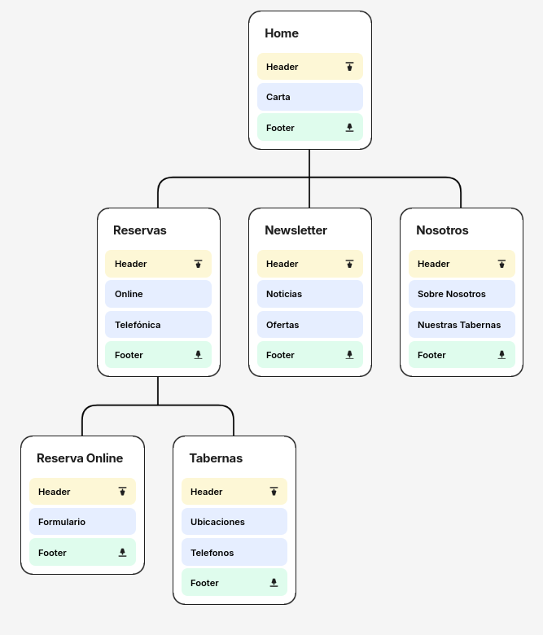

## DIU - Practica2, entregables

### 2.a Reframing / IDEACION: Feedback Capture Grid / EMpathy map 
 
---- 
En esta sección vamos a realizar un estudio de la experiencia del usuario con respecto a la temática de sabores con encanto en general y el sitio web [Ramen Shifu](https://www.ramenshifu.com/ramen-shifu-granada/) en particular. Para ello utilizaremos las siguientes herramientas:
- **Empathy Map:** Este gráfico recoge el comportamiento del usuario con respecto a sitios de ramen de temática anime, además del comportamiento en nuestra web. Recoge lo que ve y escucha, lo que piensa, dice y hace y los obstáculos y motivaciones. Diferenciamos el comportamiento de dos tipos de usuarios de la práctica 1, Andrés el usuario informático y fan del anime y Guillermo, el hombre de gustos tradicionales.
- **Feedback Capture Grid:** En cuanto a este gráfico, recoge la experiencia de usuario con respecto a la web del sitio escogido en la práctica 1. Para ello se realiza una cuadrícula dividida en las secciones: cosas que funcionaron, cosas a mejorar, dudas y propuestas.

#### Empathy Map

#### Feedback Capture Grid

### 2.b ScopeCanvas

----
Una vez hecho el estudio del usuario con respecto a esta temática y nuestro sitio web, procedemos a hacer una propuesta de valor. Cabe resaltar que, al ser una página de restauración, se espera que el uso que haga el usuario de ella sea bastante rápido, ya que normalmente este tipo de webs se visitan para tareas que se esperan que sean lo más rápidas y sencillas como ver la carta, consultar localización o hacer una reserva. Consideramos que en general el sitio [Ramen Shifu](https://www.ramenshifu.com/ramen-shifu-granada/) cumple con estas cosas bastante bien por lo que en lugar de hacer una propuesta que parta de cero, se opta por hacer un rediseño del sitio web, modificando algunos elementos que consideramos mejorables. 

Teniendo en cuenta esto, realizamos la siguiente propuesta .....

#### Scope Canvas

Este Scope Canvas recoge las necesidades de los usuarios y plantea objetivos para cumplirlas con el proposito de mejorar la experiencia de usuario.

Por ejemplo, uno de los puntos más negativos de la pagina original es el formulario de registro que aparece cuando abres la web por primera vez. Tal y como hemos comentado antes, el objetivo principal de la página es poder hacer consultas rápidas, por lo que uno de nuestros objetivos más importantes será eliminar de este formulario y sustituirlo como una opción a la hora de reservar.

Pasado un tiempo, se puede medir el desempeño de los cambios realizados mediante ciertas metricas descritas en el Scope Canvas.

### 2.c User Flow (task) analysis 
 
-----
Pasamos ahora al análisis de tareas. Para ello, usaremos User Task Flows, que indicarán los pasos que deberán seguir los usuarios para completar ciertas tareas. Además, se plantea una Task Matrix, que es una matriz que indica el interés de un tipo de usuario  en una tarea determinada. En cuánto a las tareas, como hemos comentado previamente, al ser una web de restauración se esperan que sean rápidas, sencillas y que no haya demasiadas. Es por esto que no salen diagramas de flujo muy largos ni con muchos elementos condicionales o repetitivos. Se han seleccionado las siguientes tareas:
#### Consultar la carta

#### Realizar una reserva

#### Consultar el contacto y localización

Por último, para acabar con esta sección, exponemos la matriz de tareas.
| Tarea / Usuario | Cliente afín a la gastronomía asiática | Cliente de gustos tradicionales| Cliente con varias alergias |
|----------------|---------|--------|--------|
| Ver la carta     | Alta    | Alta   | Alta   |
| Comprobar alérgenos       | Media    | Media  | Alta   |
| Hacer una reserva         | Alta   | Media  | Media   |
| Consultar localización y horarios         | Media   | Media  | Media   |
| Ver contacto         | Baja   | Media  | Media   |
| Recibir ofertas        | Alta   | Baja  | media   |

Como vemos, no existen demasiadas tareas en el sitio web y en la mayoría el interés de cada usuario suele ser parecido.

### 2.d IA: Sitemap + Labelling 
 
----

| Label             | Descripcion                                                                                                                  |
| -------------------| ------------------------------------------------------------------------------------------------------------------------------|
| Carta             | Menú del restaurante visible nada más entrar a la web. Cada item tiene descripción, imagen y está clasificado por alérgenos. |
| Online            | Enlace a la opción de reserva mediante formulario web.                                                                       |
| Telefonica        | Enlace a la opción de reserva por telefono.                                                                                  |
| Noticias          | Noticias sobre cambios relevantes al restaurante.                                                                            |
| Ofertas           | Ofertas de tiempo limitado por platos y tabernas.                                                                            |
| Sobre Nosotros    | Información sobre la historia de la cadena.                                                                                  |
| Nuestras Tabernas | Información sobre disponibilidad en distintas localidades.                                                                   |
| Formulario        | Gestión de reservas onlines. Seleccionas localidad, fecha y hora.                                                            |
| Ubicaciones       | Ubicación con enlace a mapa de cada taberna.                                                                                 |
| Telefonos         | Telefono de contacto de cada taberna.                                                                                        |
| Header            | Menú con enlaces a todas las paginas relevantes.                                                                             |
| Footer            | Menú con enlaces a información secundaria (aviso legal, trabaja con nosotros, etc.)                                          |

### 2.d Wireframes
 
-----

En esta sección, detallamos el layout para nuestra web. Primero, realizaremos unos bocetos a mano con el objetivo de tener una idea preliminar de nuestro diseño. Una vez realizado estos diseños, subiremos el nivel haciendo unos **Wireframes** en escala de grises y en formato 12 columnas de nuestra web utilizando figma:
- [Bocetos a mano](../resources/Bocetos.pdf) 

Para los wireframes, hemos seguido las indicaciones del guión y hemos seleccinado la tipografía **Luckiest Guy**, que recuerda a las letras que podemos encontrar por ejemplo en cómics.
#### Página Home ( Carta )
Comenzamos definiendo la página de inicio, que como hemos comentado, es la carta del restaurante. Esta página cuenta con la cabecera de opciones, un contenedor que muestra una oferta o noticia, unos botones llamados **Cat** que indican una categoría de plato y estarán enlazados con los platos de esa categoría, los propios platos ordenados por categoría, el mapa de **Google Maps** enlazado con la dirección en la cabecera y por último el footer con contacto y alguna otra opción.
 
 
 

 

#### Reservas y Tabernas
 
 
 

 

#### Newsletter
Esta página representa una clásica newsletter para consultar ofertas y noticias. Esta newsletter estará disponible también via email a los clientes que realicen una reserva online y marquen la casilla de recibir ofertas.

 

### Conclusiones  
(incluye valoración de esta etapa)

>>>> Este fichero se debe editar para que cada evidencia quede enlazada con el recurso subido a la carpeta de la practica. Se pide más detalle técnico en las descripciones de lo que sería el README principal del repositorio y que corresponde a la descripcion del Case Study.
>>>> Termine con la seccion de Conclusiones para aportar una valoración final del equipo sobre la propia realización de la práctica

## Paso 2. UX Design  

>>> Cualquier título puede ser adaptado. Recuerda borrar estos comentarios del template en tu documento

### 2.a Reframing / IDEACION: Feedback Capture Grid / EMpathy map 
 
----

>>> Comenta con un diagrama los aspectos más destacados a modo de conclusion de la práctica anterior. De qué carece la competencia?? Tu diagrama puede ser una figura subida a la carpeta P2/

 Interesante | Críticas     
| ------------- | -------
  Preguntas | Nuevas ideas
  
    
>>> Explica el Problema y plantea una hipótesis. Es decir, explica aquí qué 
>>> se plantea como "propuesta de valor" para un nuevo diseño de aplicación propio

### 2.b ScopeCanvas

----

>>> Propuesta de valor, pero ahora en vez de un texto es un ScopeCanvas que has subido a P2/ y enlazado desde aqui. Tambien vale una imagen miniatura del recurso.
>>> No olvides que tu propuesta ya tiene un nombre corto y puedes actualizar la cabecera de este archivo

### 2.b User Flow (task) analysis 
 
-----

>>> Definir "User Map" y "Task Flow" ... enlazar desde P2/ y describir brevemente

### 2.c IA: Sitemap + Labelling 
 
----

>>> Identificar términos para diálogo con usuario (evita el spanglish) y la arquitectura de la información. Es muy apropiado un diagrama tipo sitemap y una tabla que se ampliaría para llevar asociado la columna iconos (tanto para la web como para una app). 

Término | Significado     
| ------------- | -------
  Login  | acceder a plataforma

### 2.d Wireframes
 
-----

>>> Plantear el diseño del layout para Web/movil (organización y simulación). Describa la herramienta usada 

 
