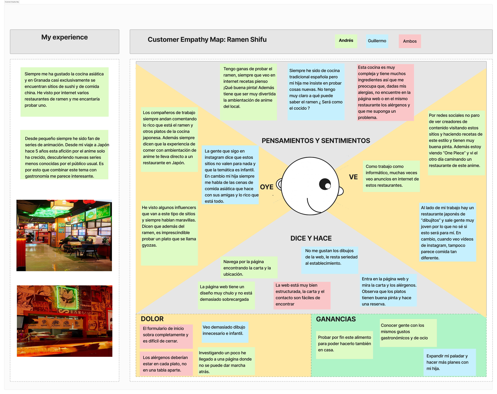
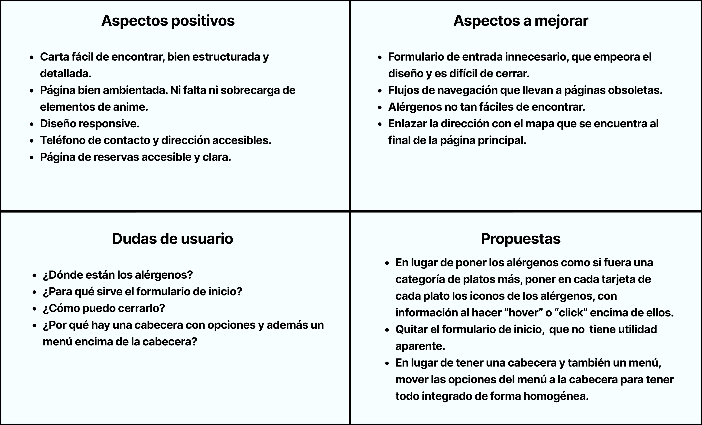
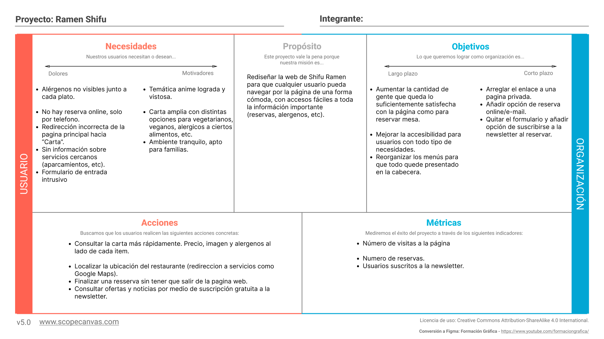
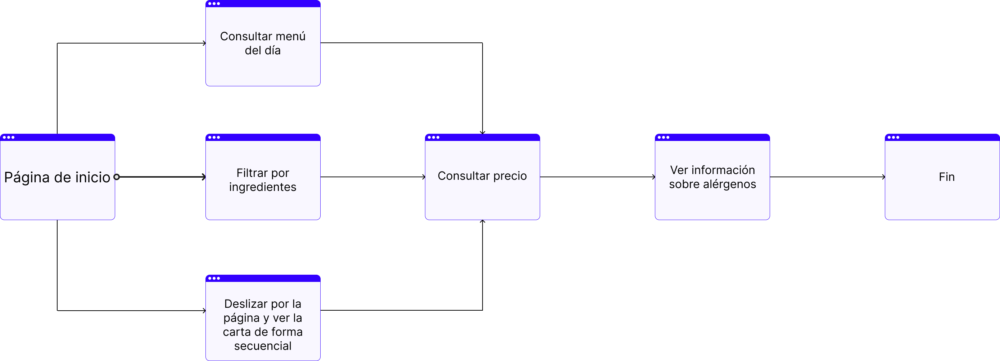
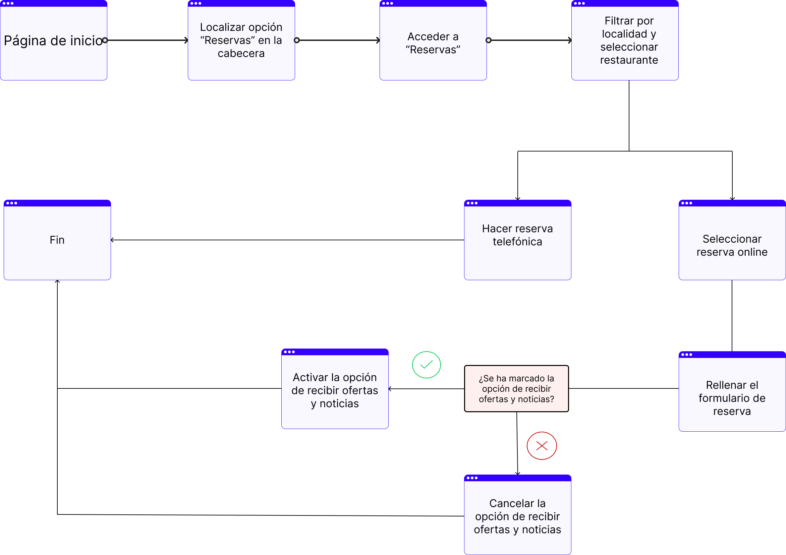
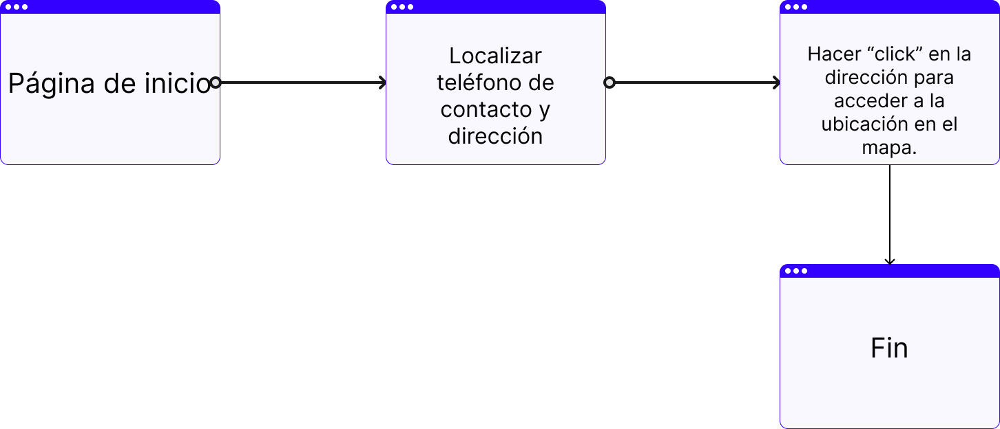

## DIU - Practica2, entregables

### 2.a Reframing / IDEACION: Feedback Capture Grid / EMpathy map 
 
---- 
En esta sección vamos a realizar un estudio de la experiencia del usuario con respecto a la temática de sabores con encanto en general y el sitio web [Ramen Shifu](https://www.ramenshifu.com/ramen-shifu-granada/) en particular. Para ello utilizaremos las siguientes herramientas:
- **Empathy Map:** Este gráfico recoge el comportamiento del usuario con respecto a sitios de ramen de temática anime, además del comportamiento en nuestra web. Recoge lo que ve y escucha, lo que piensa, dice y hace y los obstáculos y motivaciones. Diferenciamos el comportamiento de dos tipos de usuarios de la práctica 1, Andrés el usuario informático y fan del anime y Guillermo, el hombre de gustos tradicionales.
- **Feedback Capture Grid:** En cuanto a este gráfico, recoge la experiencia de usuario con respecto a la web del sitio escogido en la práctica 1. Para ello se realiza una cuadrícula dividida en las secciones: cosas que funcionaron, cosas a mejorar, dudas y propuestas.

#### Empathy Map

#### Feedback Capture Grid

### PROPUESTA DE VALOR
Una vez hecho el estudio del usuario con respecto a esta temática y nuestro sitio web, procedemos a hacer una propuesta de valor. Cabe resaltar que, al ser una página de restauración, se espera que el uso que haga el usuario de ella sea bastante rápido, ya que normalmente este tipo de webs se visitan para tareas que se esperan que sean lo más rápidas y sencillas como ver la carta, consultar localización o hacer una reserva. Consideramos que en general el sitio [Ramen Shifu](https://www.ramenshifu.com/ramen-shifu-granada/) cumple con estas cosas bastante bien por lo que en lugar de hacer una nueva propuesta, se opta por hacer un rediseño del sitio web, modificando algunos elementos que consideramos mejorables. 

Teniendo en cuenta esto, realizamos la siguiente propuesta .....

#### Scope Canvas

### TASK ANALYSIS
Pasamos ahora al análisis de tareas. Para ello, usaremos User Task Flows, que indicarán los pasos que deberán seguir los usuarios para completar ciertas tareas. Además, se plantea una Task Matrix, que es una matriz que indica el interés de un tipo de usuario  en una tarea determinada. En cuánto a las tareas, como hemos comentado previamente, al ser una web de restauración se esperan que sean rápidas, sencillas y que no haya demasiadas. Es por esto que no salen diagramas de flujo muy complejos. Se han seleccionado las siguientes tareas:
#### Consultar la carta

#### Consultar la carta

#### Consultar la carta

### ARQUITECTURA DE INFORMACIÓN

[Sitemap](./img/sitemap.png)

* Carta: Menú del restaurante visible nada más entrar a la web. Cada item tiene descripción, imagen y está clasificado por alérgenos.
* Online: Enlace a la opción de reserva mediante formulario web.
* Telefónica: Enlace a la opción de reserva por telefono.
* Noticias: Noticias sobre cambios relevantes al restaurante.
* Ofertas: Ofertas de tiempo limitado por platos y tabernas.
* Ubicaciones: Ubicación con enlace a mapa de cada taberna.
* Telefonos: Telefono de contacto de cada taberna.
* Sobre Nosotros: Información sobre la historia de la cadena.
* Nuestras Tabernas: Información sobre disponibilidad en distintas localidades.
* Formulario: Gestión de reservas onlines. Seleccionas localidad, fecha y hora.
* Tabernas: Gestión de reservas telefónicas. Seleccionas la taberna de tu localidad y te dirige a la sección con información sobre esa taberna.
* Header: Menú con enlaces a todas las paginas relevantes.
* Footer: Menú con enlaces a información secundaria (aviso legal, trabaja con nosotros, etc.)

### Prototipo Lo-FI Wireframe 

### Conclusiones  
(incluye valoración de esta etapa)

>>>> Este fichero se debe editar para que cada evidencia quede enlazada con el recurso subido a la carpeta de la practica. Se pide más detalle técnico en las descripciones de lo que sería el README principal del repositorio y que corresponde a la descripcion del Case Study.
>>>> Termine con la seccion de Conclusiones para aportar una valoración final del equipo sobre la propia realización de la práctica

## Paso 2. UX Design  

>>> Cualquier título puede ser adaptado. Recuerda borrar estos comentarios del template en tu documento

### 2.a Reframing / IDEACION: Feedback Capture Grid / EMpathy map 
 
----

>>> Comenta con un diagrama los aspectos más destacados a modo de conclusion de la práctica anterior. De qué carece la competencia?? Tu diagrama puede ser una figura subida a la carpeta P2/

 Interesante | Críticas     
| ------------- | -------
  Preguntas | Nuevas ideas
  
    
>>> Explica el Problema y plantea una hipótesis. Es decir, explica aquí qué 
>>> se plantea como "propuesta de valor" para un nuevo diseño de aplicación propio

### 2.b ScopeCanvas

----

>>> Propuesta de valor, pero ahora en vez de un texto es un ScopeCanvas que has subido a P2/ y enlazado desde aqui. Tambien vale una imagen miniatura del recurso.
>>> No olvides que tu propuesta ya tiene un nombre corto y puedes actualizar la cabecera de este archivo

### 2.b User Flow (task) analysis 
 
-----

>>> Definir "User Map" y "Task Flow" ... enlazar desde P2/ y describir brevemente

### 2.c IA: Sitemap + Labelling 
 
----

>>> Identificar términos para diálogo con usuario (evita el spanglish) y la arquitectura de la información. Es muy apropiado un diagrama tipo sitemap y una tabla que se ampliaría para llevar asociado la columna iconos (tanto para la web como para una app). 

Término | Significado     
| ------------- | -------
  Login  | acceder a plataforma

### 2.d Wireframes
 
-----

>>> Plantear el diseño del layout para Web/movil (organización y simulación). Describa la herramienta usada 

 
