# DIU - Practica 3, entregables

- Moodboard (diseño visual + logotipo)   
- Landing Page
- Mockup: LAYOUT HI-FI
- Publicación del Case Study

## Paso 3. Mi UX-Case Study (diseño)

### 3.a Moodboard

-----
La **moodboard** es una tabla que registra la identidad y el propósito de nuestra marca. Se define tanto la descripción del proyecto, como los elementos visuales del mismo como la paleta de colores, el logo, la frase inspiradora, la tipografía y las imágenes de marca. De esta forma, definimos de forma muy resumida pero clara todos los detalles de nuestra marca. Además, se ilustran elementos inspiradores para la marca, como imágenes que concuerden con la filosofía del proyecto u opiniones de usuarios sobre la temática de nuestro proyecto. Por cuestiones de visibilidad, se mostrará la moodboard por partes.

Como vemos, definimos claramente nuestra marca, donde vemos un sitio de restauración de gastronomía japonesa con estética de anime, carcaterizado por colores y tipografía urbana.
### 3.b Landing Page
 
----
Una vez definido el corazón de nuestro sitio web, buscamos definir un prototipo de nuestra **landing page**, es decir, la primera página que ve el usuario al entrar en nuestro sitio web. Como ya se comentó en prácticas anteriores, nos pareció un acierto por parte de la página original el que la **landing page** fuera la **carta**, ya que es lo que el usuario suele buscar al entrar en webs de restauración. De esta forma, nos ahorramos la búsqueda de la carta y mostramos al usuario lo que quiere.

Para hacer esta landing page, se hizo uso de **figma make**. Seleccionamos nuestra moodboard y seleccionamos la opción de **"Enviar a figma make"**. De esta forma le cargamos nuestra moodboard a la IA de figma a la cuál le podemos pedir que nos genere cosas a partir de ella. Como resultado obtuvimos lo siguiente:
<h1>Primera vista en tamaño de pantalla</h1>

 

<h1>Versión página entera</h1>

Como podemos observar, obtenemos una página con un header claro y conciso y que muestra lo más importante al inicio, el **hero section** que contiene las categorías de platos. Al hacer click en estas cards, se redirecciona a la sección correspondiente en la misma página. En la versión completa, podemos observar como tenemos elementos como contenedores de noticias/ofertas y las propias secciones de platos bien estructuradas. Por último, tenemos la localización en forma de mapa seguido del footer con información básica.
Cabe destacar que la página sigue siendo un boceto susceptible a cambios. Por ejemplo, tenemos que dotar al sitio de temática anime. Esto lo conseguiríamos siguiendo la metodología del sitio original realizando dibujos sobre anime que estén sobre el fondo beige.

Como hemos comentado, se ha hecho uso de figma make para la obtención de esta página. Para ello se ha hecho uso de los siguientes prompt:

**Prompt 1**
Esa es mi moodboard. Mi sitio web es un sitio ramen de tematica anime con las caracteristicas de los moodboard. Para mejor entendimiento, los colores más usados serán negro y rojo. El rojo se espera que sea el color en headers y elementos a resaltar y el negro el que servirá como contenedor de por ejemplo cards o texto. El beige será el color de fondo. Quiero una landing page con las siguientes caracteristicas. La cabecera me gustaria que tuviera el logo en fondo negro, debajo (tambien como parte del header en fondo negro) quiero telefono direccion y horario de apertura. Debajo ( tambien como parte dde la cabecera pero esta vez en rojo ) quiero carta reservas y tabernas, newsletter y nosotros. la Hero section tendrá una label que nacerá desde la parte de la izquierda en fondo rojo y texto negro que pondrá "CARTA" y debajo 8 botones que representarán las categorías de platos. debajo se verá un contenedor rectangular que tendra en un lado una foto y en el otro un texto sobre noticia y oferta. Debajo de esto habrá 2 contenedores en fondo negro con una label en fondo rojo con la categoria del plato. este contenedor negro tendrá dos cards de plato, formadas por una foto un titulo y una descripcion. Después vendra un recuadro que contendra un mapa en google maps y despues un footer en gris. 

**Prompt 2**
El diseño es muy bueno pero quiero que contenga el logo adjunto y que sea responsive.

**Prompt 3**
Vale, quiero intentar integrar todos los elementos de la cabecera en una unica fila de color Rojo. Ademas, en lugar de tener solo un boton por categoria de plato, me gustaria tener una pequeña imagen encima de cada boton que muestre el tipo de plato.

De esta forma, vemos la evolución de la construcción de nuestra página. Con el prompt 1 realizamos una descripción detallada de como queremos la página a partir de la información de nuestra **moodboard**. Con el prompt 2, especificamos que sea responsive. El prompt 3 fue fruto de que, al mostrar la página al profesor, le parecía poco atractivo visualmente e instó a incluir no sólo botones con las categorías de platos sino también imágenes.
[Enlace a figma make](https://www.figma.com/make/6iAXaY25XUXkjPk2F00U8b/Landing-page-for-ramen-site?t=9PmqYdFBYCD9SG9Z-0)

### 3.c Design System
 
----
Una vez obtenido la **moodboard** y la **landing page** tenemos la base y un ejemplo de construcción de nuestro sitio web. Se procede ahora a la realización del design system. Para ello, se ha hecho uso del plugin **Deliverrr**. Este plugin nos permite obtener las **foundations** a partir de ciertos datos de nuestra moodboard, como son los colores primarios (rojo), secundarios (negro) y neutral (beige) y tipografías Bebas Neue (headlines) y Saira (body). Con esta información, nos genera una guía en figma de uso de estos colores y tipografía. Por ejemplo, nos muestra los 3 colores en diferentes opacidades y asigna los **Design token** de manera automática, de forma que podemos buscar los colores por **color-primary-500** en lugar de tener que buscar su versión en hexadecimal. Para la tipografía genera algo parecido, genera los tamaños y el salto de línea tanto para las headlines en formato Bebas Neue (h1-h6) como para la letra de body en formato Saira ( large, medium, small y caption ). De nuevo, vuelve a generar los **design tokens** para utilizar las fuentes con total comodidad. Además de esto, generó otras utilidades como la escala de **padding** para el cuál también generaba de forma automática los **design token**.

Pasamos ahora a mostrar nuestro **atomic design**, pasando de elementos menos complejos a más complejos. Cabe destacar que todos loc componentes han sido diseñados con **autolayout (shift+A en figma)** para garantizar un diseño responsive. Además, se ha hecho uso de **variantes** y propiedades en figma, pudiendo usar componentes con ligeras modificaciones de una forma mucho más fácil y eficiente.

<h1>Átomos</h1>

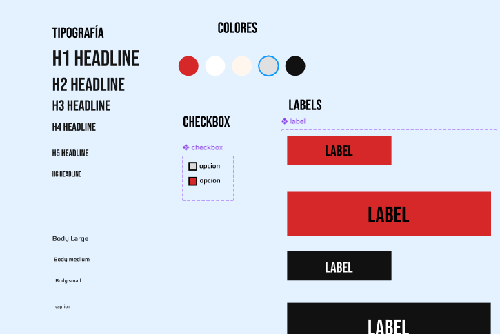 
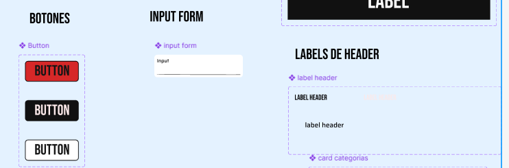

Como podemos ver, comenzamos definiendo los componentes más básicos como son la tipografía en diferentes tamaños, los colores, labels, checkboxes, inputs de formulario, botones y labels de header.

Cabe destacar que para los botones, se han definido 3 variantes: rojo, negro y blanco . Haciendo uso del apartado prototipo, establecemos que al hacer hover sobre el botón rojo, debe convertirse en el botón blanco. El botón negro se deja como variante auxiliar en caso de usar sobre algún fondo blanco o rojo. En este caso, hemos relacionado el botón rojo con el blanco porque la mayoría de contenedores son negros y por tanto desaparecería la estética del botón negro. Para el uso de checkboxes se ha hecho algo de forma similar, se definen dos tipos checked y unchecked y al hacer click en una variante, te lleva a la otra. Del mismo modo, en las labels de header, al hacer hover sobre la label de tipo headline negro, se cambia a la label de headline beige, indicando así que contiene un enlace. 

También se han definido variantes como para las labels generales, sin relaciones de prototipo entre ellas.

<h1>Moléculas</h1>

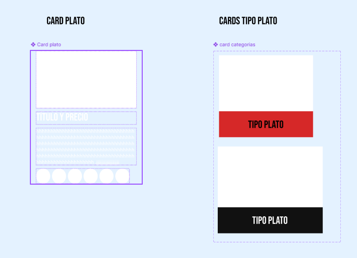 
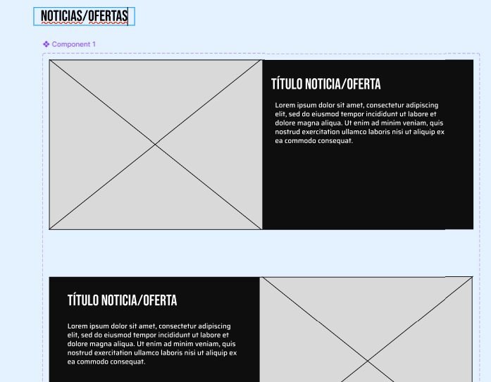

Como podemos observar, tenemos 3 tipos diferentes de cards. El primero ( se ve de ese modo porque se espera que esté integrado en un contenedor de color negro ), es un contenedor que contiene una imagen, título, descripción e iconos de alérgenos en disposición vertical. El segundo tipo de card, es la card de categoría de plato, que aparecerá en el hero section como vimos en la landing page. En este caso se han definido dos variantes, una con etiqueta roja que representará el estado normal de la card y otra con la etiqueta negra y ligeramente más grande que será la variante que habrá al hacer hover sobre la primera. Por último tenemos el contenedor de noticias que en función de su variante contendrá la imagen a la izquierda/derecha y el texto a la derecha/izquierda.

<h1>Organismos</h1>

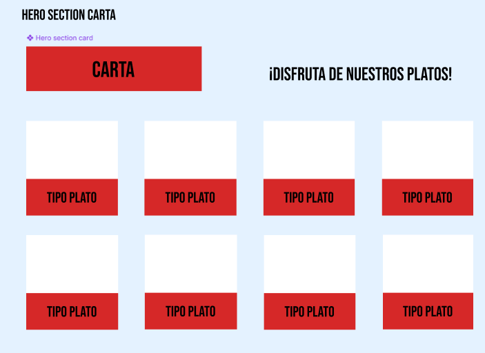 
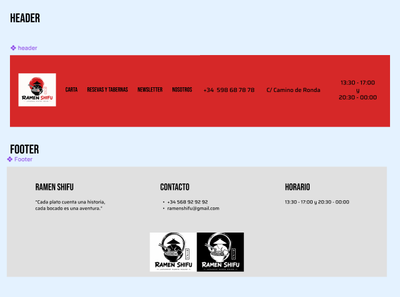

Primero, destacamos la **hero section**. Esta estará formada por una label grande en rojo que indicará que es la carta, seguido de un mensaje motivador y por último, una tabla de cards de tipos de plato. Con esto conseguimos darle al cliente de primeras lo que busca, que es la carta. Con la modificación de añadir imágenes a estos botones de tipo de plato, conseguimos una vista más atractiva.

Seguimos con el header. Este contiene el logo y enlaces a cada una de las páginas del sitio web mostradas por labels en formato **Bebas Neue** mientras que la información general se muestra en formato **Saira**. Por último concluímos con un footer en gris muy clásico, mostrando nuestra **frase inspiradora** e información general.

<h1>Patrones</h1>

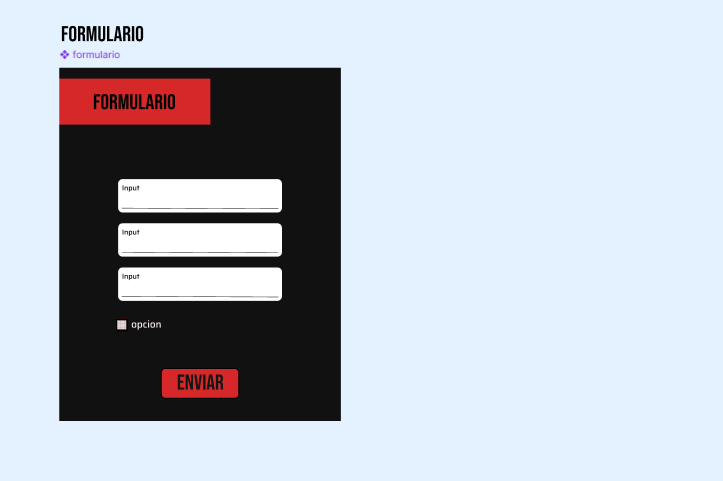 
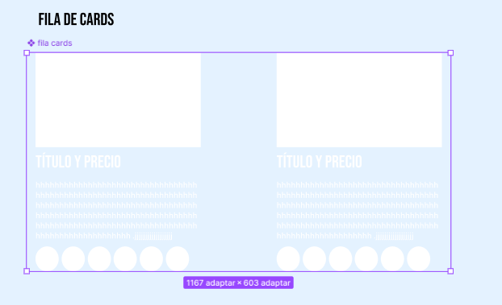
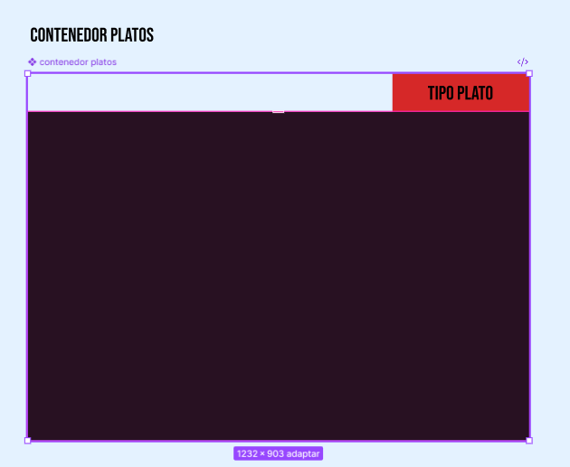

Para comenzar con los patrones, destacamos un **formulario básico**. Este estará formado por un contenedor negro, una **label** en rojo, una serie de **inputs** variables, una serie de **checkboxes** variables y un **botón** de envío.

Finalizamos el design system con los organismos **fila cards** y **contenedor platos**. Como sus propios nombres indican, estos representarán una fila de dos cards de platos y el contenedor en negro que contiene a estos platos. En lugar de hacer un patrón único combinando estas dos, se ha obtado por hacerlo por separado ya que en un contenedor de platos no tiene por qué haber sólo dos platos ( una fila cards ) sino que esta cantidad es variable. Es por esto que se deja la responsabilidad al diseñador de establecer el tamaño adecuado del contenedor e incluir tantas fila card o card individuales como desee.

Toda esta información se pued encontrar en nuestro archivo figma en el apartado foundations [Enlace a figma]().

### 3.d Mockup
 
----
A partir del Design System realizado, podemos construir las páginas para nuestra web.
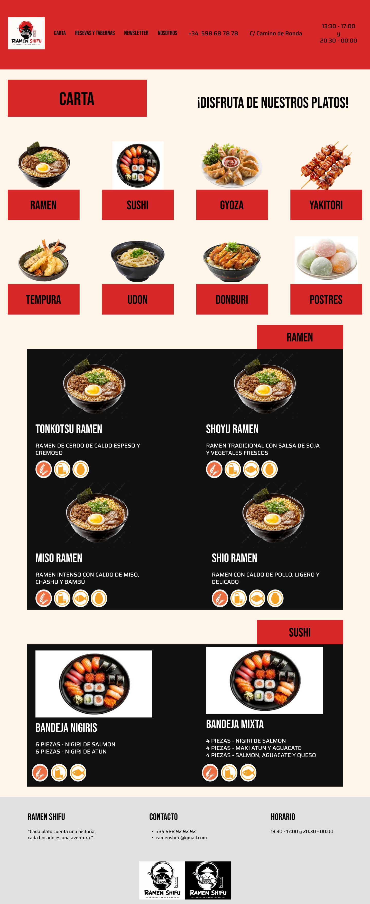
Es una imitación de la landing page que había generado Figma Make. Nada más entrar a la página nos encontramos con la carta. Al clicar un componente de la hero section te desplaza al apartado correspondiente de la página.
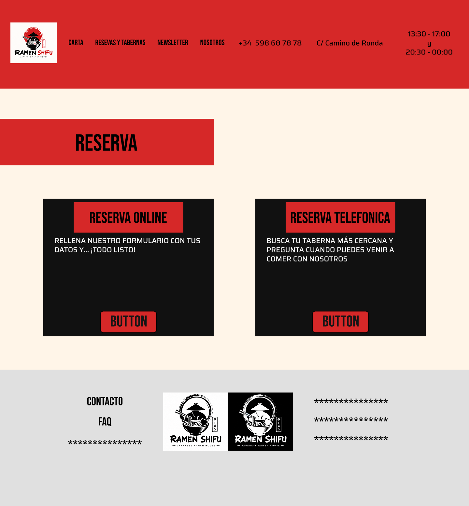
Los botones cambian de variante al hacer hover y te dirigen a la página correspondiente al clicar.
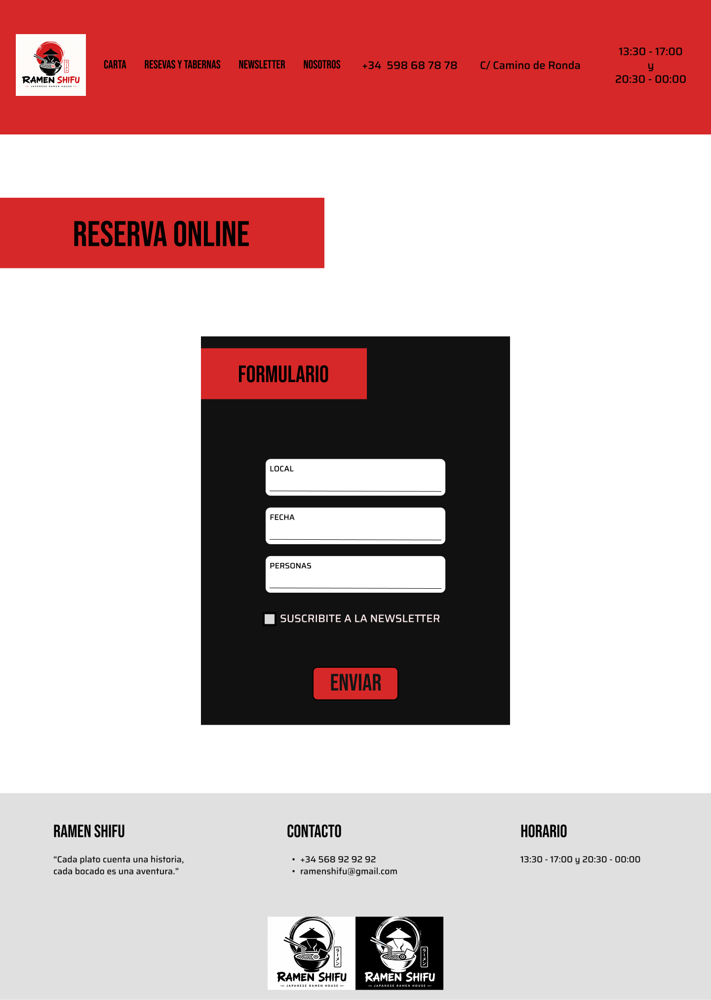
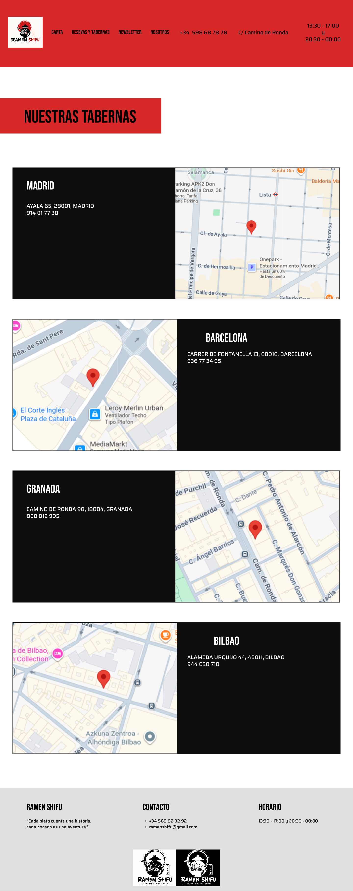
Cada sección tiene un enlace a su dirección en **Google Maps**.
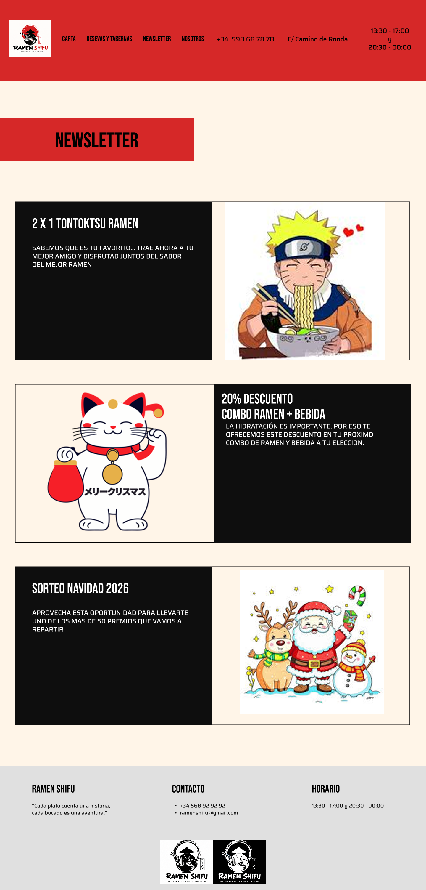
