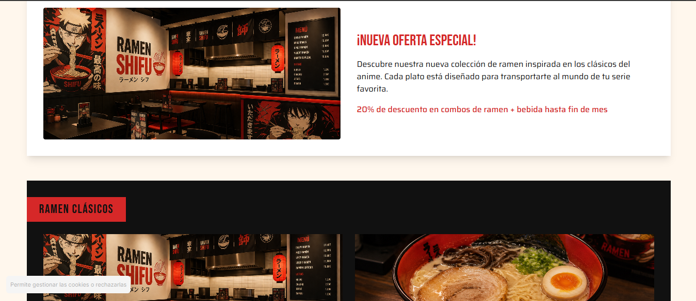
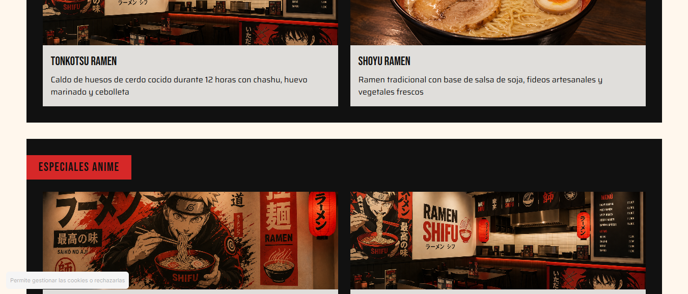
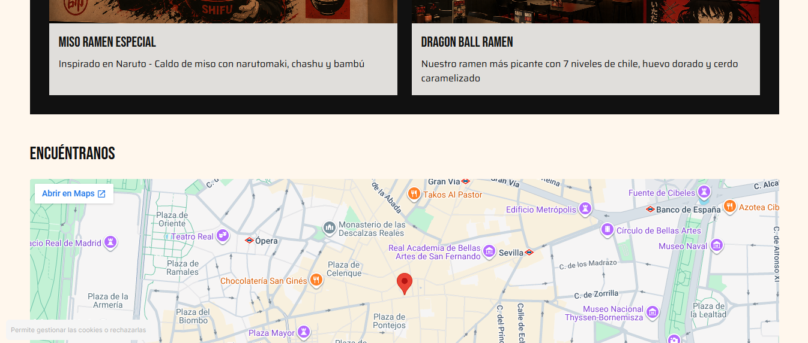
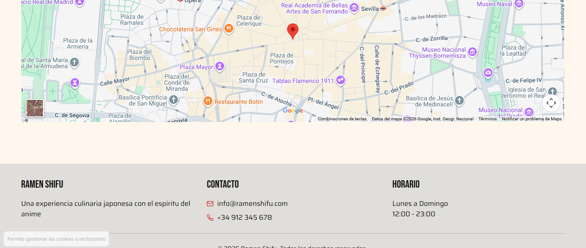

# DIU - Practica 3, entregables

- Moodboard (diseño visual + logotipo)   
- Landing Page
- Mockup: LAYOUT HI-FI
- Publicación del Case Study

## Paso 3. Mi UX-Case Study (diseño)

### 3.a Moodboard

-----
La **moodboard** es una tabla que registra la identidad y el propósito de nuestra marca. Se define tanto la descripción del proyecto, como los elementos visuales del mismo como la paleta de colores, el logo, la frase inspiradora, la tipografía y las imágenes de marca. De esta forma, definimos de forma muy resumida pero clara todos los detalles de nuestra marca. Además, se ilustran elementos inspiradores para la marca, como imágenes que concuerden con la filosofía del proyecto u opiniones de usuarios sobre la temática de nuestro proyecto. Por cuestiones de visibilidad, se mostrará la moodboard por partes.

Como vemos, definimos claramente nuestra marca, donde vemos un sitio de restauración de gastronomía japonesa con estética de anime, carcaterizado por colores y tipografía urbana.
### 3.b Landing Page
 
----
Una vez definido el corazón de nuestro sitio web, buscamos definir un prototipo de nuestra **landing page**, es decir, la primera página que ve el usuario al entrar en nuestro sitio web. Como ya se comentó en prácticas anteriores, nos pareció un acierto por parte de la página original el que la **landing page** fuera la **carta**, ya que es lo que el usuario suele buscar al entrar en webs de restauración. De esta forma, nos ahorramos la búsqueda de la carta y mostramos al usuario lo que quiere.

Para hacer esta landing page, se hizo uso de **figma make**. Seleccionamos nuestra moodboard y seleccionamos la opción de **"Enviar a figma make"**. De esta forma le cargamos nuestra moodboard a la IA de figma a la cuál le podemos pedir que nos genere cosas a partir de ella. Como resultado obtuvimos lo siguiente:
<h1>Primera vista en tamaño de pantalla</h1>

 

<h1>Versión página entera</h1>

Como podemos observar, obtenemos una página con un header claro y conciso y que muestra lo más importante al inicio, el **hero section** que contiene las categorías de platos. Al hacer click en estas cards, se redirecciona a la sección correspondiente en la misma página. En la versión completa, podemos observar como tenemos elementos como contenedores de noticias/ofertas y las propias secciones de platos bien estructuradas. Por último, tenemos la localización en forma de mapa seguido del footer con información básica.
Cabe destacar que la página sigue siendo un boceto susceptible a cambios. Por ejemplo, tenemos que dotar al sitio de temática anime. Esto lo conseguiríamos siguiendo la metodología del sitio original realizando dibujos sobre anime que estén sobre el fondo beige.

Como hemos comentado, se ha hecho uso de figma make para la obtención de esta página. Para ello se ha hecho uso de los siguientes prompt:

**Prompt 1**
Esa es mi moodboard. Mi sitio web es un sitio ramen de tematica anime con las caracteristicas de los moodboard. Para mejor entendimiento, los colores más usados serán negro y rojo. El rojo se espera que sea el color en headers y elementos a resaltar y el negro el que servirá como contenedor de por ejemplo cards o texto. El beige será el color de fondo. Quiero una landing page con las siguientes caracteristicas. La cabecera me gustaria que tuviera el logo en fondo negro, debajo (tambien como parte del header en fondo negro) quiero telefono direccion y horario de apertura. Debajo ( tambien como parte dde la cabecera pero esta vez en rojo ) quiero carta reservas y tabernas, newsletter y nosotros. la Hero section tendrá una label que nacerá desde la parte de la izquierda en fondo rojo y texto negro que pondrá "CARTA" y debajo 8 botones que representarán las categorías de platos. debajo se verá un contenedor rectangular que tendra en un lado una foto y en el otro un texto sobre noticia y oferta. Debajo de esto habrá 2 contenedores en fondo negro con una label en fondo rojo con la categoria del plato. este contenedor negro tendrá dos cards de plato, formadas por una foto un titulo y una descripcion. Después vendra un recuadro que contendra un mapa en google maps y despues un footer en gris. 

**Prompt 2**
El diseño es muy bueno pero quiero que contenga el logo adjunto y que sea responsive.

**Prompt 3**
Vale, quiero intentar integrar todos los elementos de la cabecera en una unica fila de color Rojo. Ademas, en lugar de tener solo un boton por categoria de plato, me gustaria tener una pequeña imagen encima de cada boton que muestre el tipo de plato.

De esta forma, vemos la evolución de la construcción de nuestra página. Con el prompt 1 realizamos una descripción detallada de como queremos la página a partir de la información de nuestra **moodboard**. Con el prompt 2, especificamos que sea responsive. El prompt 3 fue fruto de que, al mostrar la página al profesor, le parecía poco atractivo visualmente e instó a incluir no sólo botones con las categorías de platos sino también imágenes.
[Enlace a figma make](https://www.figma.com/make/6iAXaY25XUXkjPk2F00U8b/Landing-page-for-ramen-site?t=9PmqYdFBYCD9SG9Z-0)

### 3.c Guidelines
 
----

>>> Estudio de Guidelines y explicación de los Patrones IU a usar 
>>> Es decir, tras documentarse, muestre las deciones tomadas sobre Patrones IU a usar para la fase siguiente de prototipado. 

### 3.d Mockup
 
----

>>> Consiste en tener un Layout en acción. Un Mockup es un prototipo HTML que permite simular tareas con estilo de IU seleccionado. Muy útil para compartir con stakeholders
