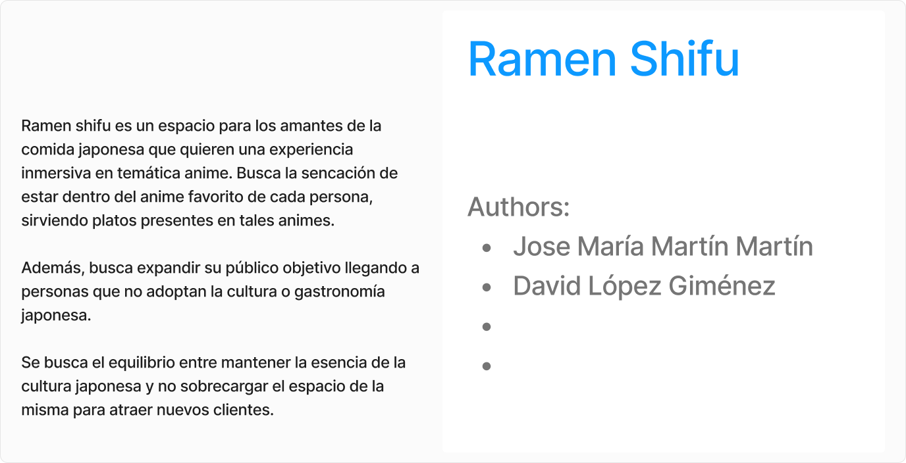
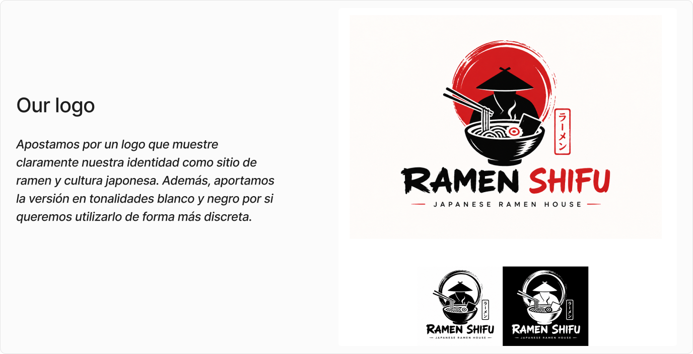
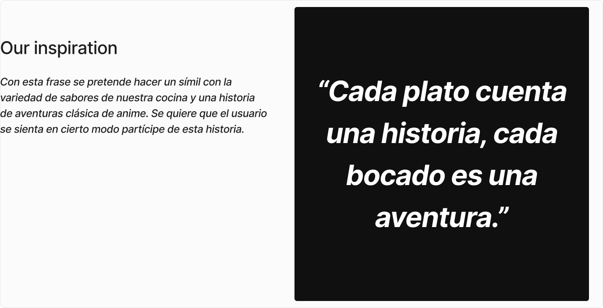
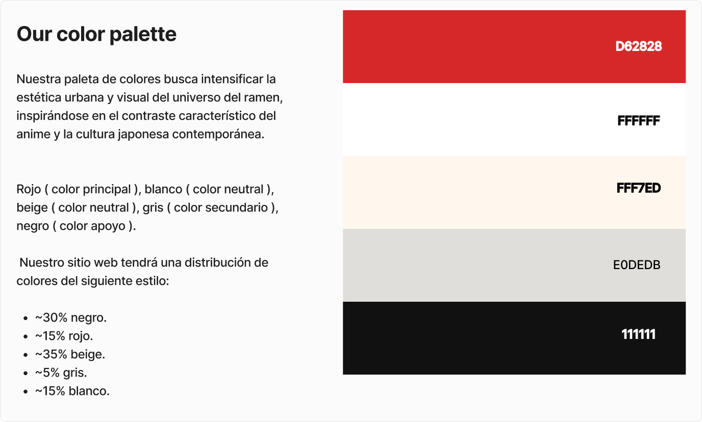
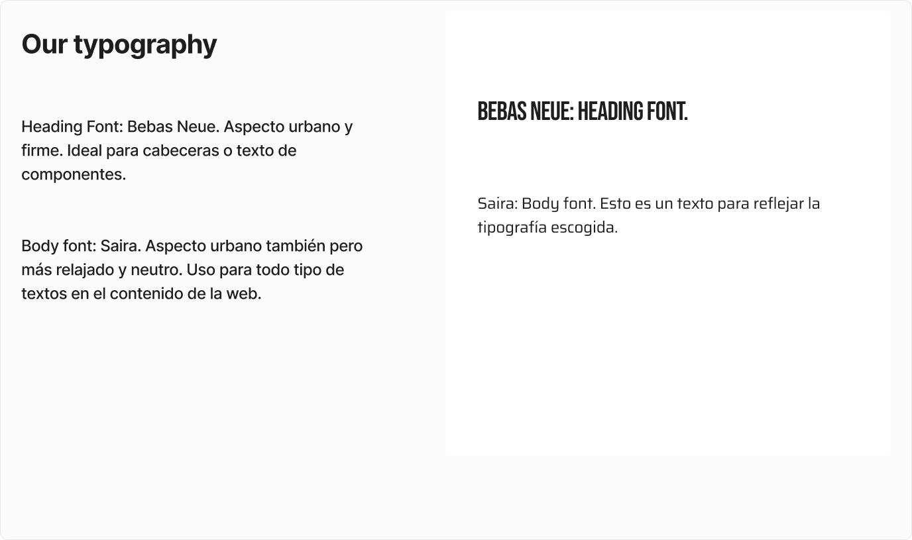
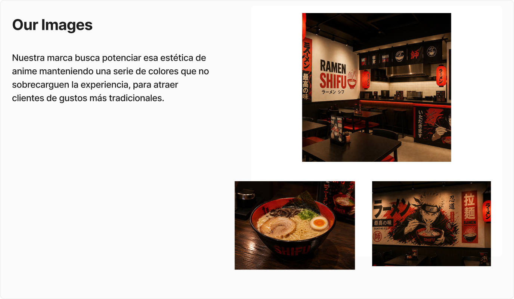
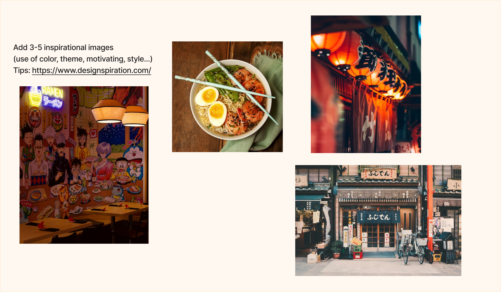
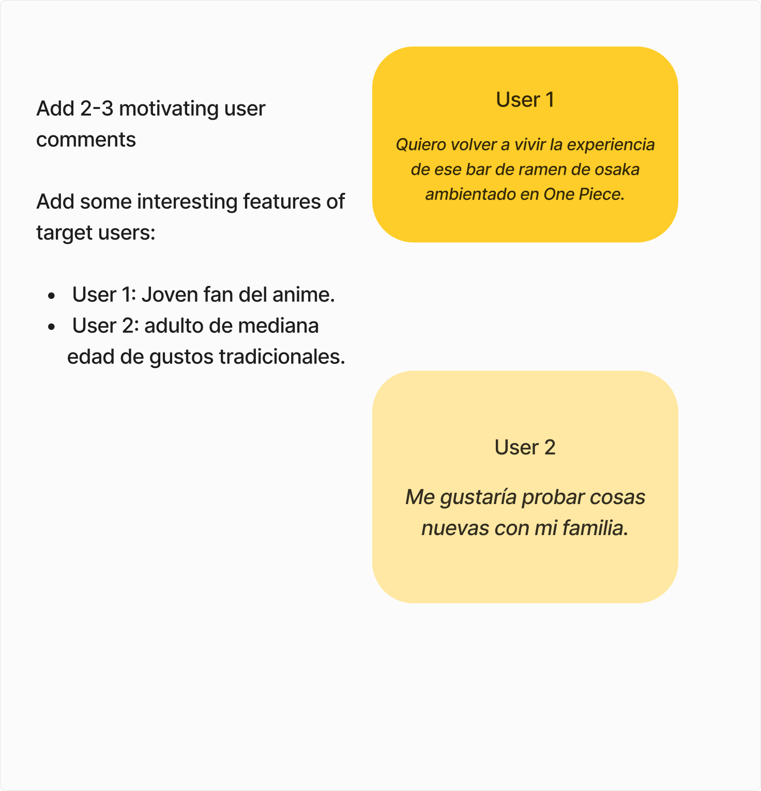
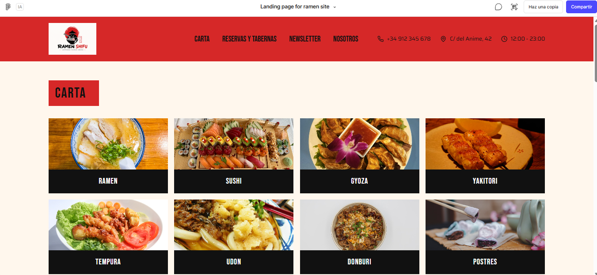

# DIU - Practica 3, entregables

- Moodboard (diseño visual + logotipo)   
- Landing Page
- Mockup: LAYOUT HI-FI
- Publicación del Case Study

## Paso 3. Mi UX-Case Study (diseño)

### 3.a Moodboard

-----
La moodboard es una tabla que registra la identidad y el propósito de nuestra marca. Se define tanto la descripción del proyecto, como los elementos visuales del mismo como la paleta de colores, el logo, la frase inspiradora, la tipografía y las imágenes de marca. De esta forma, definimos de forma muy resumida pero clara todos los detalles de nuestra marca. Además, se ilustran elementos inspiradores para la marca, como imágenes que concuerden con la filosofía del proyecto u opiniones de usuarios sobre la temática de nuestro proyecto. Por cuestiones de visibilidad, se mostrará la moodboard por partes.

Como vemos, definimos claramente nuestra marca, donde vemos un sitio de restauración de gastronomía japonesa con estética de anime, donde se distinguen colores y tipografía urbana.
### 3.b Landing Page
 
----
Una vez definido el corazón de nuestro sitio web, buscamos definir un prototipo de nuestra landing page, es decir, la primera página que ve el usuario al entrar en nuestro sitio web. Como ya se comentó en prácticas anteriores, nos pareció un acierto por parte de la página original el que la landing page fuera la carta, ya que es lo que el usuario suele buscar al entrar en webs de restauración. De esta forma, nos ahorramos la búsqueda de la carta y mostramos al usuario lo que quiere.

Para hacer esta landing page, se hizo uso  de figma make. Seleccionamos nuestra moodboard y seleccionamos la opción de "Enviar a figma make". De esta forma le cargamos nuestra moodboard a la IA de figma a la cuál le podemos pedir que nos genere cosas a partir de ella. Como resultado obtuvimos lo siguiente:

 

### 3.c Guidelines
 
----

>>> Estudio de Guidelines y explicación de los Patrones IU a usar 
>>> Es decir, tras documentarse, muestre las deciones tomadas sobre Patrones IU a usar para la fase siguiente de prototipado. 

### 3.d Mockup
 
----

>>> Consiste en tener un Layout en acción. Un Mockup es un prototipo HTML que permite simular tareas con estilo de IU seleccionado. Muy útil para compartir con stakeholders
